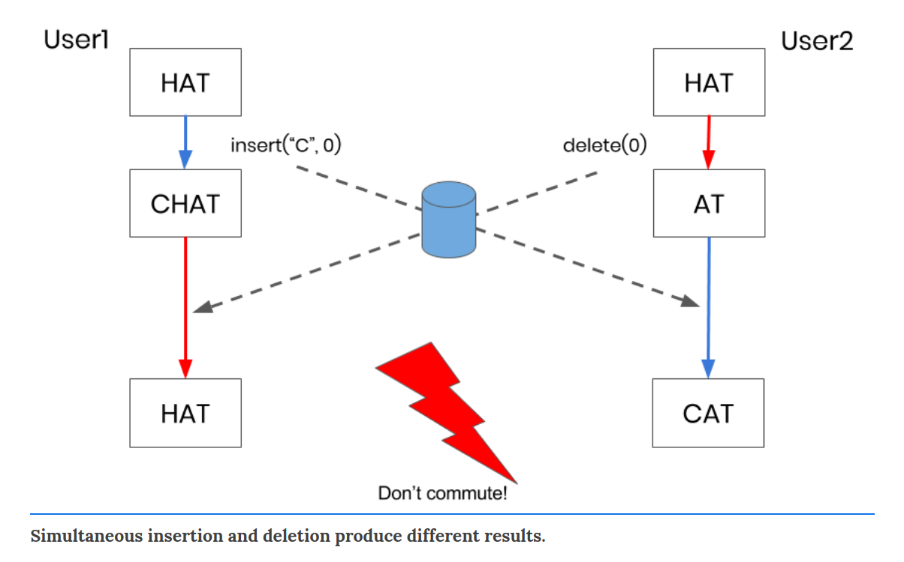
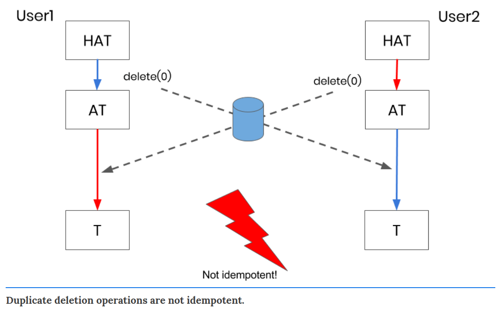
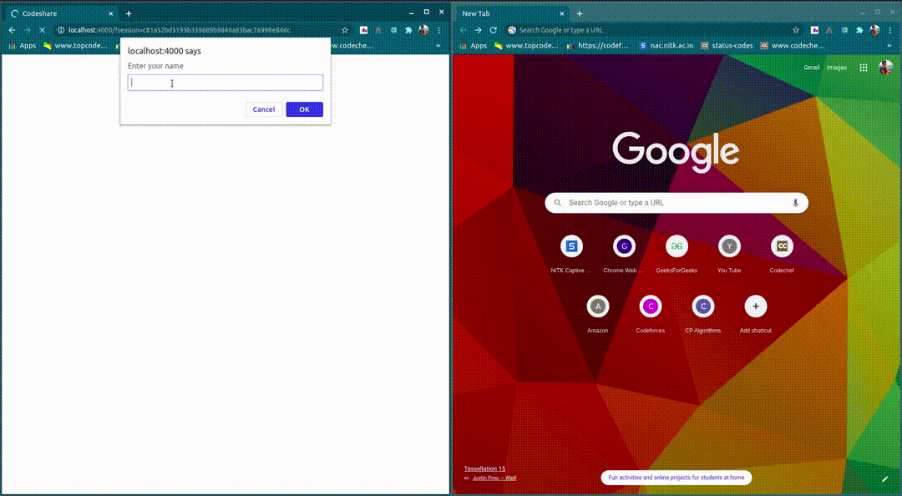

# CodeShare

CodeShare is a web-based real-time code sharing tool. It empowers developers to collaborate remotely during hackathons, contests or for a project. It can also be potentially used in mentorship programs to live share code. The tool also compiles and runs code.

## Team members:
1. Rohit M P
2. Shanthanu S Rai
3. Ameya N Deshpande
4. Harshvardhan R
5. Vaibhav Puri

## Objectives:

Following were the objectives:
1. Compare [Codemiror](https://codemirror.net/) vs [Monaco](https://microsoft.github.io/monaco-editor/) and integrate either of them.
2. To create a server-based system using Websockets (Channel).
3. Display the users and their respective cursors on the editor.
4. Implement [CRDT](https://en.wikipedia.org/wiki/Conflict-free_replicated_data_type) functions to handle consistency amongst users. 
5. Create different sessions (Rooms) on the Channel.
6. Maintain a database for recording all the changes in the editor.
7. Send the latest code to newly joined user and delete database contents after last user leaves.
8. Provide code compilation and execution for different languages.

## Methodology

Codeshare is a "real-time" code sharing tool i.e. all the changes made in one editor are applied immediately to other editors on the same session. The project is based on a Central Relay Server which manages the connection between all the users of a session and maintains a database to store the operations performed by them.

While trying to achieve real-time collaboration, we do not make use of blocking statements or try to serialize the opertions by different users (For example, insert character, delete charater, insert newline, etc.). We try and handle all the possible operations in such a way that the following properties hold:
1. **Commutativity**: Concurrent Insert and Delete operations must converge to the same result regardless of the order in which they are applied.
2. **Idempotency**: Repeated delete operations produce the same result.

Here, is an example why we must take care of these properties:

*Source: [https://conclave-team.github.io/conclave-site/](https://conclave-team.github.io/conclave-site/)*

*Source: [https://conclave-team.github.io/conclave-site/](https://conclave-team.github.io/conclave-site/)*

To take care of the above two properties, we decided on maintaining a data structure on each client's side, namely **Conflict-Free Replicated Data Type (CRDT)**. Following points explain the essence of CRDT:
1. **Globally Unique Charaters**: Every character in the editor is treated as unique.
2. **Globally Ordered Characters**: All the characters indices must be ordered. This is mainly achieved using fractional indices.
For example, let's say the editor contains a word "CAT" with 'C' as index 1, 'A' as index 2 and 'T' as index 3. We want to insert a charater 'H' between 'C' and 'A', then we give 'H' as an index of 1.5. This leads us to "CHAT".
Fractional indices are implemented as a list of numbers. For example, above we have [1], [1, 5], [2] and [3].

In general, every character is represented as a pair of the ASCII character and fractional index. For example, say there are two users (# and $) and they perform the operation in the following order:
1. User # types 'C'.
2. User # types 'A' in front of 'C'.
3. User $ types 'T' in front of 'A'.
4. User $ inserts 'H' between 'C' and 'A'.

Then, following is the representation in CRDT: 
*['C', [[1, #]]]* 
*['H', [[1, #], [5, $]]]* 
*['A', [[2, #]]]* 
*['T', [[3, $]]]*

At a high-level, it can be interpreted as: 
*C - 1* 
*H - 1.5* 
*A - 2* 
*T - 3* 

i.e. 'C' has index 1, 'H' has index 1.5, 'A' has index 2 and 'T' has index 3.

Using a data structure like this will consume more space for each client but will help us in maintaining *Commutativity during insertion and deletion* and *Idempotency during deletions*. For a character insertion, a new identifier list is generated and for a character deletion, the list is returned back to the available pool.

## Demo:

## Applications:

Following are the applications of Codeshare:
1. Real-time collaboration with team.
2. Online IDE supporting C, C++, Java, Python and Javascript.
3. Ideal tool to demonstrate a code (during interviews and mentorship programmes).

## References:

1. [https://elixir-lang.org/docs.html](https://elixir-lang.org/docs.html)
2. [https://hexdocs.pm/phoenix/Phoenix.html](https://hexdocs.pm/phoenix/Phoenix.html)
3. [https://github.com/dwyl/phoenix-chat-example](https://github.com/dwyl/phoenix-chat-example)
4. [https://conclave-team.github.io/conclave-site/](https://conclave-team.github.io/conclave-site/)
5. [http://digitalfreepen.com/2017/10/06/simple-real-time-collaborative-text-editor.html](http://digitalfreepen.com/2017/10/06/simple-real-time-collaborative-text-editor.html)
6. [https://codemirror.net/](https://codemirror.net/)
7. [https://microsoft.github.io/monaco-editor/](https://microsoft.github.io/monaco-editor/)
